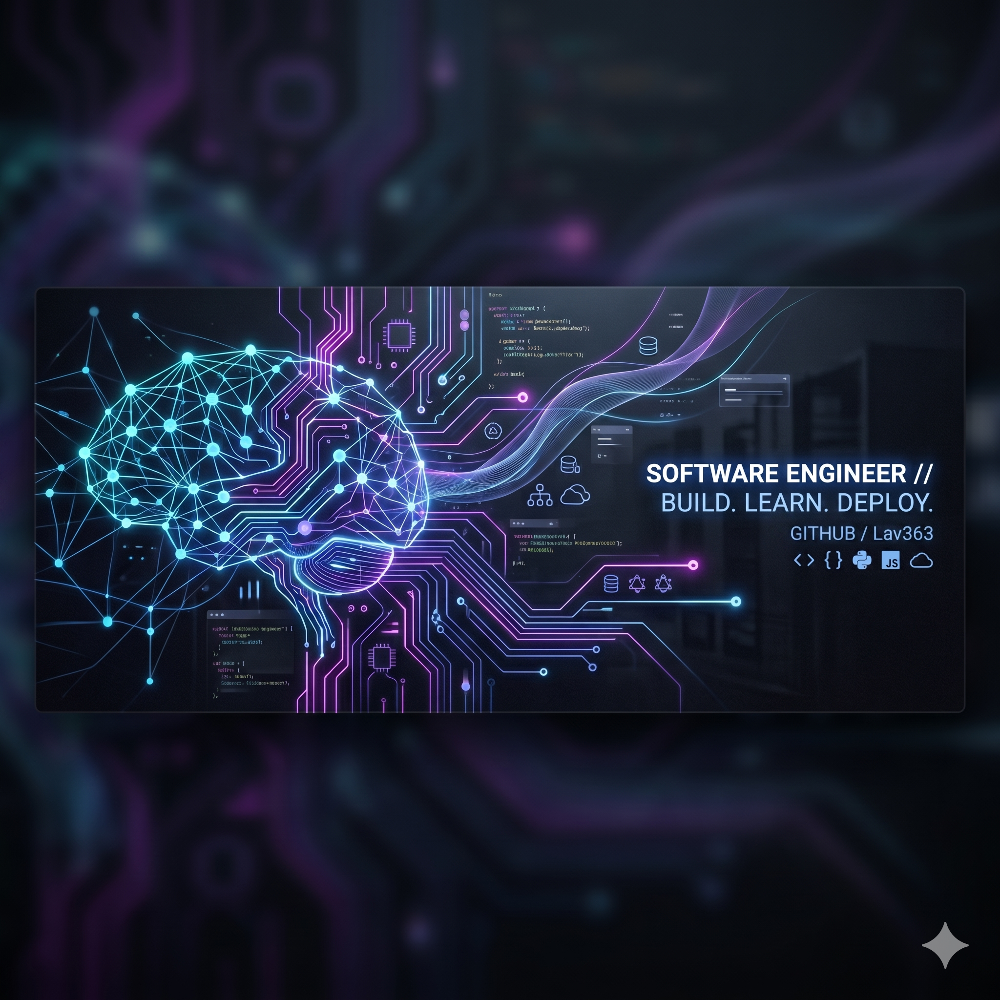

# 🌌 Lavanya K | GitHub Profile

  

  

<h3 align="center">B.E. Computer Science and Engineering Student</h3>

  📍 India | 🎓 Graduation: 2027 | 📊 CGPA: 8.236 / 10 | 📧 <a href="mailto:lavanyaviji410@gmail.com">lavanyaviji410@gmail.com</a>

  
  
  

---

## 👩‍💻 About Me

Computer Science and Engineering student at **KGiSL Institute of Technology** with strong foundations in Software Development, Full Stack Web Development, Artificial Intelligence, and Data Analytics. Passionate about problem-solving, building scalable systems, and exploring emerging technologies.

- 🎯 **Looking For**: Summer/Fall 2026 and 2027 Internship opportunities in **Software Engineering**, **Full Stack Development**, **Data Engineering**, and **AI/ML**.
- 💡 **Key Interests**: AI-driven applications, full-stack systems, computer vision, data analysis, and software design.
- 🎓 **Education**: B.E. Computer Science & Engineering | KGiSL Institute of Technology (CGPA: 8.236/10) | Class of 2027.
- ⚡ **Fun Fact**: I designed a full-stack nurse scheduling system that won **2nd Prize** in a Hackathon!

---

## 🛠️ Technical Toolkit

| Category | Technologies |
| :--- | :--- |
| **Languages** |     |
| **Frontend** |    |
| **Backend & APIs** |     |
| **Databases** |    |
| **AI / Data Analytics** |           |
| **Tools & DevOps** |      |

### 🧠 Core Concepts
`Data Structures & Algorithms (DSA)` • `Object-Oriented Programming (OOP)` • `Database Management Systems (DBMS)` • `Software Development Life Cycle (SDLC)`

---

## 💼 Experience

### **Full Stack Development Intern** | Nandha Infotech
*June 2025 – July 2025 | India*
- 🚀 **Web Development**: Designed and implemented responsive, modern frontend UI components and structured backend code.
- 🔌 **API Engineering**: Built and integrated robust REST APIs to ensure high performance and seamless data flow.
- 🛠️ **Tools & DevOps**: Leveraged `Git`, `GitHub`, `Docker`, and `Postman` within an agile team workflow.
- ⚙️ **Optimization**: Debugged application bottlenecks, optimized database queries, and participated in testing and deployment.

---

## 🏆 Featured Projects

<table border="0">
  <tr>
    <!-- Project 1 -->
    <td width="50%" valign="top">
      <h3>🏥 Nursing Allocation Management System</h3>
      
<em>A robust full-stack nurse scheduling and leave management platform optimizing healthcare administration.</em>

      

        
        
        
        
      

      <ul>
        <li>🥇 Won <b>2nd Prize</b> in a competitive Hackathon.</li>
        <li>Implemented full CRUD actions and secure REST APIs for roster automation.</li>
      </ul>
      

        <a href="https://github.com/Lav363"><b>🖥️ Repository</b></a>
      

    </td>
    <!-- Project 2 -->
    <td width="50%" valign="top">
      <h3>🛡️ Safety Compliance Detector</h3>
      
<em>A real-time workplace safety monitoring system powered by computer vision.</em>

      

        
        
        
        
      

      <ul>
        <li>Automated detection of PPE compliance (helmets, vests) in live video.</li>
        <li>Built an interactive alerts and reporting dashboard.</li>
      </ul>
      

        <a href="https://github.com/Lav363"><b>🖥️ Repository</b></a>
      

    </td>
  </tr>
  <tr>
    <!-- Project 3 -->
    <td width="50%" valign="top">
      <h3>🌾 Coimbatore Agri-Chain 2.0</h3>
      
<em>AI-powered agricultural market intelligence platform mapping price trends and supply chain workflows.</em>

      

        
        
        
        
      

      <ul>
        <li>Developed Python AI components for predictive price tracking.</li>
        <li>Established full-stack synchronization using Spring Boot and SQLite.</li>
      </ul>
      

        <a href="https://github.com/Lav363"><b>🖥️ Repository</b></a>
      

    </td>
    <!-- Project 4 -->
    <td width="50%" valign="top">
      <h3>📄 AI Content & Visual Article Analyzer</h3>
      
<em>Scholarly document processing pipeline for extracting and generating insights from research texts.</em>

      

        
        
        
        
      

      <ul>
        <li>Integrated PyTorch models, OCR, and NLP pipelines to parse articles.</li>
        <li>Extracted data structures, tables, and text layouts with OpenCV.</li>
      </ul>
      

        <a href="https://github.com/Lav363"><b>🖥️ Repository</b></a>
      

    </td>
  </tr>
</table>

  
<b>🔍 View Additional Projects</b>

   
  <ul>
    <li>🗺️ <b>Tamil Nadu School Finder</b> (Node.js, Express.js, MongoDB) - District-based school search engine featuring interactive mapping and query optimization.</li>
    <li>🏳️ <b>Flag Identifier AI</b> (Python, TensorFlow, Keras, Flask) - Deep learning computer vision application classifying 224 global flags.</li>
    <li>📊 <b>E-Commerce Product Sales Analysis</b> (SQL, Excel, Power BI) - Strategic sales analytics dashboard modeling KPIs and business intelligence trends.</li>
  </ul>

---

## 🏅 Certifications & Achievements

- 🐍 **PCAP: Programming Essentials in Python** | *Cisco & OpenEDG*
- ☁️ **Oracle Cloud Infrastructure 2025 AI Foundations Associate** | *Oracle*
- 📜 **Cisco JavaScript Essentials 1** | *Cisco*
- 🤖 **SAWIT.AI Learnathon: Fundamentals of Generative AI** | *SAWIT.AI*
- 🍃 **Introduction to MongoDB** | *MongoDB University*
- 🎓 **Full Stack Development Internship** | *Nandha Infotech*
- 💻 **Software Development Internship** | *CodeAlpha*

---

## 📊 Git Analytics & Insights

  
  

  
  

  

---

### ⚡ Beyond the Code
* 📚 **Currently Leveling Up**: Deepening skills in Deep Learning architectures, Vector databases, and Cloud deployments.
* 🧩 **Interests**: Solving algorithmic puzzles, optimizing code architectures, and participating in hackathons.
* 💬 **Let's Connect**: Open to collaborating on innovative open-source projects or discussed internship opportunities.

  <i>Developed with 💙 by Lavanya K | 2026</i>

